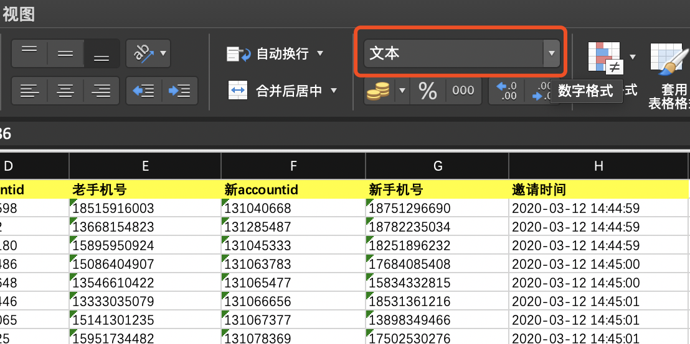

# 基本知识
## 运算符
1. 计算
    
    +、-、*、/、^、%

2. 非计算
   
    |  符号  | 说明  | 实例 |
    |  ----  | ----  | ---- |
    | =、<>、>、<、>=、<=  | 比较运算符：等于、不等于、大于、小于、大于等于、小于等于 |=(A1=A2),判断A1和A2相等|
    | &  | 文本运算符:连接文本 |="E"&"H"，返回文本"EH"|
    | : （冒号）| 区域运算符:两个之间所有单元格的引用 |=SUM(A1:B6)|
    | , （逗号）| 联合运算符:将多个引用合并 |=SUM(A1,B6)|
3. 优先级（略）

## 数据类型
1. 文本型
   
   

2. 数值型
   
   
3. 日期型

    
## 引用
   $ 美元符号后面的行或者列在进行拖动时不会变
   
   e.g. 九九乘法表
   
   
   

## 快捷键
1. 快捷健

   | 执行操作 | 快捷键组合 |
   | ---- | ---- |
   | 重复最后一次操作 | F4 |
   | 选择区域扩展到同行最后的非空单元格 | Ctrl + Shift + 箭头|
   | 刷成同样的格式 | 格式刷 |
   

# 常用函数
## 文本数据处理
1. 文本的合并

    CONCAT(text1,text2...)函数或者"&"符号
    
    
2. 展示重复项
    把重复的单元格标红
    

3. 删除重复项
    把列里重复的行删掉
    

4. 分列
    把单元格里合并的值分开
    
    

5. 替换
   
   
   

6. 清除多余空格
   
   TRIM(text)函数
    

7. 数字格式化
   
    NUMBERVALUE(text)函数
    

8. 自定义排序筛选

    对多行进行排序
    
    
    
    筛选号码大于14000000000
    
    
    
9. 分组
    
    对数据进行分组
    
    
    
    

## 信息提取与逻辑判断

1. 信息提取
   
    LEFT、MID、RIGHT(text)函数
    提取第一个字
    
    

2. 逻辑判断

    IF(逻辑判断,为真返回值,为假返回值)函数
    判断一个值是否大于5
    

    IFERROR(text,前一个为假则返回)函数
    当值出错时，返回另一个值（可用于屏蔽错误）
    
    
## 日期和时间的计算

1. 日期

    YEAR(date)、MONTH(date)、DAY(date)函数
    
    

## 查找和引用

1. 查找
   
    VLOOKUP(查找值,查找范围,返回,匹配程度)函数

    精确匹配
   

    模糊匹配
    模糊匹配时匹配不到查找值时，会返回比查找值小的最接近的值
   

## 统计和求和

1. COUNTIF(统计范围,统计逻辑)函数
  
    统计大于3的数的个数
    
2. SUMIF(统计范围,统计逻辑)函数

    求大于3的数的和
    

# 数据透视表

数据透视表主要作用是用于数据汇总和展示
## 数据更新和布局
1. 创建和布局
    
    创建数据透视表
    
    
    可以把数据布局为你想要的方式
    

## 排序和筛选
1. 排序
   
   这个和普通的排序一样
   
   

2. 筛选

    这个和普通的筛选一样
   
   
## 计算字段

1. 计算字段
    
    新生成一个你想要的计算后的字段，用于数据表展示
    
    
    
    
