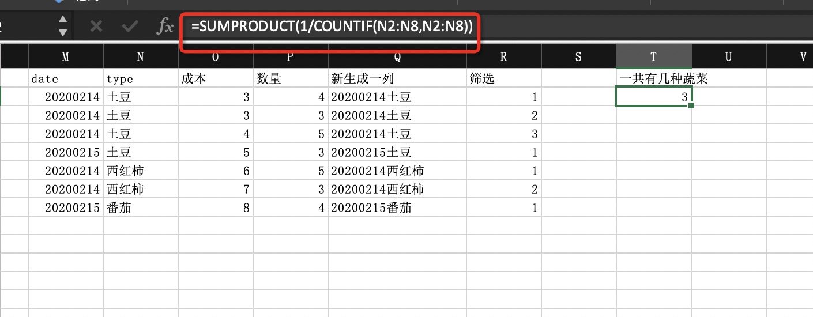
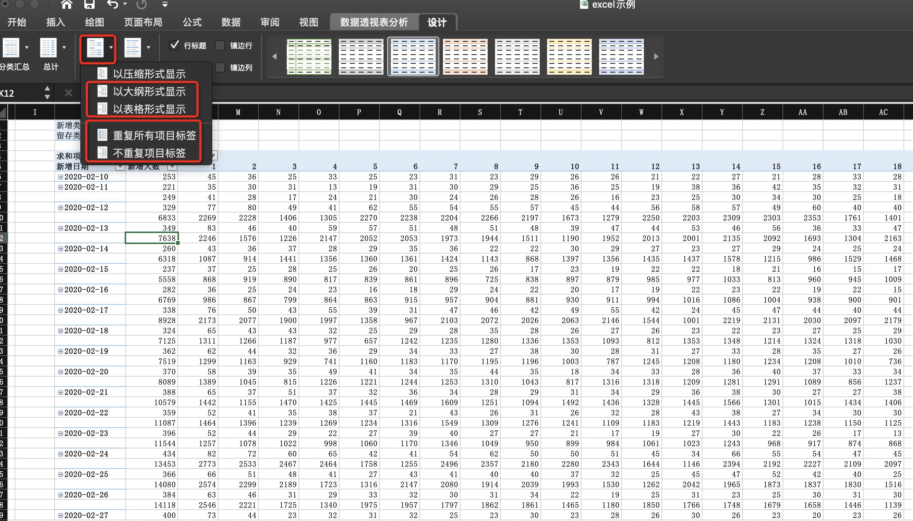

# 基本知识
## 运算符
1. 计算
    
    +、-、*、/、^、%

2. 非计算
   
    |  符号  | 说明  | 实例 |
    |  ----  | ----  | ---- |
    | =、<>、>、<、>=、<=  | 比较运算符：等于、不等于、大于、小于、大于等于、小于等于 |=(A1=A2),判断A1和A2相等|
    | &  | 文本运算符:连接文本 |="E"&"H"，返回文本"EH"|
    | : （冒号）| 区域运算符:两个之间所有单元格的引用 |=SUM(A1:B6)|
    | , （逗号）| 联合运算符:将多个引用合并 |=SUM(A1,B6)|
3. 优先级（略）

## 数据类型
1. 文本型
   
   

2. 数值型
   
   
3. 日期型

    
## 引用
   | 引用类型 | 样式 | 特性 |
   | ---- | ---- | ---- |
   |绝对引用| =$A$1 | 公式向右向下不改变引用关系 |
   |相对引用| =A1 | 公式向右向下都改变引用关系 |
   |行绝对引用列相对引用| =$A1 | 公式向右不改变引用关系，向下改变引用关系|
   |行相对引用列绝对引用| =A$1 | 公式向右改变引用关系，向下不改变引用关系|

## 快捷键
   | 执行操作 | 快捷键组合 |
   | ---- | ---- |
   | 重复最后一次操作 | F4 |
   | 选择区域扩展到同行最后的非空单元格 | Ctrl + Shift + 箭头|
   | 撤销 | Ctrl + Z |
   | 复制 | Ctrl + C |
   | 粘贴 | Ctrl + V |
   | 保存 | Ctrl + S |
   | 字体加粗 | Ctrl + B |
   | 选定当前有活动单元格的区域 | Ctrl + A |

# 常用函数
## 文本数据处理
1. 文本的合并

    CONCAT(text1,text2...)函数或者"&"符号
    
    
2. 展示重复项

    

3. 删除重复项

    

4. 分列

    
    

5. 替换
   
   
   

6. 清除多余空格
   
   TRIM(text)函数
    

7. 数字格式化
   
    NUMBERVALUE(text)函数
    

## 信息提取与逻辑判断

1. 信息提取
   
    LEFT、MID、RIGHT(text)函数
    

2. 逻辑判断

    IF(逻辑判断,为真返回值,为假返回值)函数
    

    IFERROR(text,前一个为假则返回)函数
    
## 日期和时间的计算

1. 日期

    YEAR(date)、MONTH(date)、DAY(date)函数
    
    

## 查找和引用

1. 查找
   
    VLOOKUP(查找值,查找范围,返回,匹配程度)函数

    精确匹配
   

    模糊匹配
   

## 统计和求和

1. COUNTIF(统计范围,统计逻辑)函数
   
   筛选不重复数据
   

   统计不重复的蔬菜有哪些
   

# 数据透视表
## 数据更新和布局
1. 更新和布局

    

    

## 排序和筛选
1. 排序
   
   

2. 筛选

   
## 计算字段

1. 计算字段

    
    
    
    